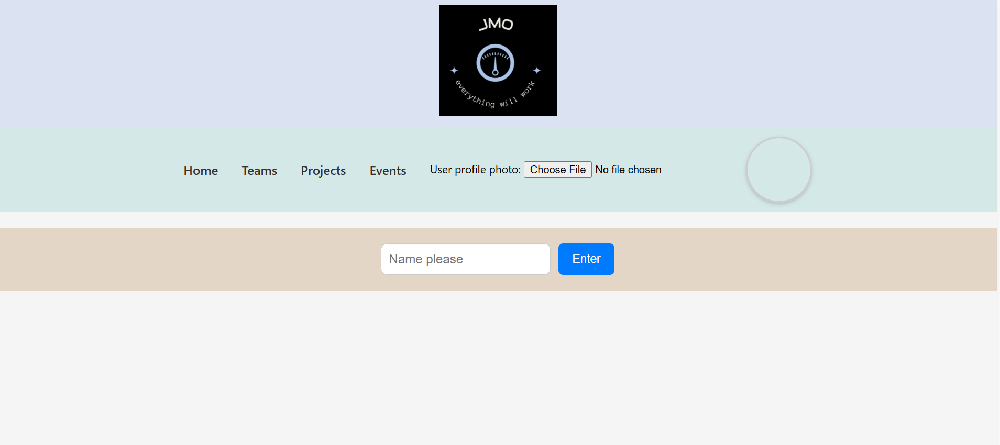

# Team Management Web Project

This is a simple static web project that showcases different teams, their members, projects, and events in a company.

## 🌐 Pages Included

- `index.html` – Home page with logo and navigation
- `teams.html` – Team list 
-  `team.html`-Team members list
- `projects.html` – Team-wise project showcase
- `event.html` – Past/upcoming events listing

## 💻 Technologies Used

- HTML
- CSS
- JavaScript (for simple search)

## 🔧 Features

- Team member search bar
- Separate project and event sections
- Simple navigation between pages

## 📁 How to Run

1. Download or clone this repository.
2. Open `index.html` in your browser.
3. Use the navigation bar to explore the site.

## 📷 Preview

*Company Logo*

*Homepage with navigation and team sections*

